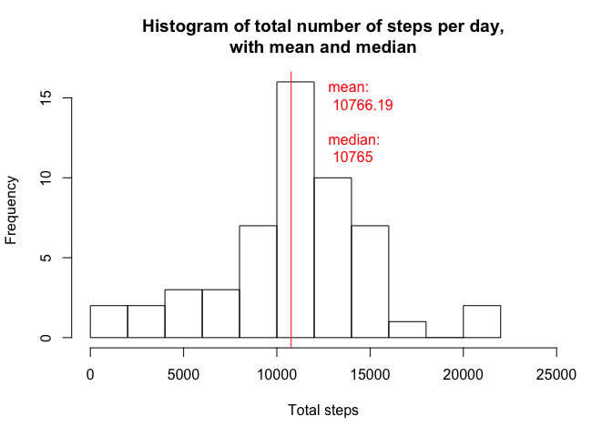

# Reproducible Research: Peer Assessment 1
amz25  
June 12, 2015  


## Loading and preprocessing the data


```r
activity <- read.csv("activity.csv")
activity$interval <- ((floor(activity$interval/100) * 60) + (activity$interval %% 100))
summary(activity)
```

```
##      steps                date          interval     
##  Min.   :  0.00   2012-10-01:  288   Min.   :   0.0  
##  1st Qu.:  0.00   2012-10-02:  288   1st Qu.: 358.8  
##  Median :  0.00   2012-10-03:  288   Median : 717.5  
##  Mean   : 37.38   2012-10-04:  288   Mean   : 717.5  
##  3rd Qu.: 12.00   2012-10-05:  288   3rd Qu.:1076.2  
##  Max.   :806.00   2012-10-06:  288   Max.   :1435.0  
##  NA's   :2304     (Other)   :15840
```

*(Note: original data set used intervals that were not continuous.  The original times were just converted straight to numbers, so the intervals jump from 55 to 100, 155 to 200, etc. To plot the intervals correctly so there is no gap between minute "55" and minute "00", the intervals have been converted to the number of minutes after midnight each day.  The new "interval" column thus has a continuous sequence of numbers from 0 to 1435 each day.)*

## What is mean total number of steps taken per day?

### 1. Calculate the total number of steps taken per day


```r
steps_per_day <- setNames(aggregate(steps~date, data=activity, FUN=sum), c("Days", "TotalSteps"))
head(steps_per_day,10)
```

```
##          Days TotalSteps
## 1  2012-10-02        126
## 2  2012-10-03      11352
## 3  2012-10-04      12116
## 4  2012-10-05      13294
## 5  2012-10-06      15420
## 6  2012-10-07      11015
## 7  2012-10-09      12811
## 8  2012-10-10       9900
## 9  2012-10-11      10304
## 10 2012-10-12      17382
```

*Calculated total number of steps per day.  Showing just the first ten rows.*

### 2. Make a histogram of the total number of steps taken each day


```r
hist(steps_per_day$TotalSteps, breaks=10, xlim=c(0,25000), main="Histogram of total number of steps per day", xlab="Total steps")
```

 

### 3. Calculate and report the mean and median of the total number of steps taken per day


```r
mean_daily_steps <- mean(steps_per_day$TotalSteps[!is.na(steps_per_day$TotalSteps)])
cat("Mean daily steps: ", mean_daily_steps)
```

```
## Mean daily steps:  10766.19
```

```r
median_daily_steps <- median(steps_per_day$TotalSteps[!is.na(steps_per_day$TotalSteps)])
cat("Median daily steps: ", median_daily_steps)
```

```
## Median daily steps:  10765
```

```r
hist(steps_per_day$TotalSteps, breaks=10, xlim=c(0,25000), main="Histogram of total number of steps per day,\nwith mean and median", xlab="Total steps")
abline(v=mean_daily_steps, col = "red", lwd = 1)
text(mean_daily_steps + 2000,11,paste("mean:\n",round(mean_daily_steps, 2),"\n\nmedian:\n",round(median_daily_steps, 2)), col = "red", adj = c(0,0))
```

 

## What is the average daily activity pattern?

### 1. Make a time series plot of the 5-minute interval (x-axis) and the average number of steps taken, averaged across all days (y-axis)


```r
steps_per_interval <- setNames(aggregate(activity$steps[!is.na(activity$steps)], by=list(activity$interval[!is.na(activity$steps)]), FUN=mean), c("Intervals", "AvgSteps"))

plot(steps_per_interval$Intervals, steps_per_interval$AvgSteps, type="l", main="Average steps per time interval", xlab="Time intervals", ylab="Average steps, excluding NAs", xlim=c(0,1440), xaxt = "n")
at <- seq(from = 0, to = 1440, by = 240)
axis(side = 1, at = at, labels=c("0:00","4:00","8:00","12:00","16:00","20:00","0:00"))
```

 


### 2. Which 5-minute interval, on average across all the days in the dataset, contains the maximum number of steps?


```r
steps_per_interval[which.max(steps_per_interval$AvgSteps),]
```

```
##     Intervals AvgSteps
## 104       515 206.1698
```

## Imputing missing values

### 1. Calculate and report the total number of missing values in the dataset (i.e. the total number of rows with NAs)


```r
cat("Number of rows with missing data in original dataset: ",nrow(activity[is.na(activity$steps),]))
```

```
## Number of rows with missing data in original dataset:  2304
```

### 2. Devise a strategy for filling in all of the missing values in the dataset. The strategy does not need to be sophisticated. For example, you could use the mean/median for that day, or the mean for that 5-minute interval, etc.

*I will use the mean for that 5-minute interval as a substitute for the NA values.  Code below.*

### 3. Create a new dataset that is equal to the original dataset but with the missing data filled in.


```r
imputed_activity <- merge(activity, steps_per_interval, by.x = "interval", by.y = "Intervals")
imputed_activity$steps[is.na(imputed_activity$steps)] <- imputed_activity$AvgSteps[is.na(imputed_activity$steps)]
imputed_activity <- imputed_activity[,c(1:3)]
cat("Number of rows with missing data in imputed dataset: ",nrow(imputed_activity[is.na(imputed_activity$steps),]))
```

```
## Number of rows with missing data in imputed dataset:  0
```

### 4. Make a histogram of the total number of steps taken each day and calculate and report the mean and median total number of steps taken per day. Do these values differ from the estimates from the first part of the assignment? What is the impact of imputing missing data on the estimates of the total daily number of steps?


```r
steps_per_day_imputed <- setNames(aggregate(imputed_activity$steps, by=list(imputed_activity$date), FUN=sum), c("Days", "TotalSteps"))

mean_daily_steps_imputed <- mean(steps_per_day_imputed$TotalSteps)
cat("Mean daily steps with imputed values: ",mean_daily_steps_imputed)
```

```
## Mean daily steps with imputed values:  10766.19
```

```r
median_daily_steps_imputed <- median(steps_per_day_imputed$TotalSteps)
cat("Median daily steps with imputed values: ",median_daily_steps_imputed)
```

```
## Median daily steps with imputed values:  10766.19
```

```r
hist(steps_per_day_imputed$TotalSteps, breaks=10, xlim=c(0,25000), main="Histogram of total number of steps per day,\nwith imputed values", xlab="Total steps")
abline(v=mean_daily_steps_imputed, col = "red", lwd = 1)
text(mean_daily_steps_imputed + 2000,10,paste("mean:\n",round(mean_daily_steps_imputed, 2),"\n\nmedian:\n",round(median_daily_steps_imputed, 2)), col = "red", adj = c(0,0))
```

 

*The values are not very different from the earlier values.  The mean is exactly the same, and the median has become the same as the mean.  The impact of the imputed values can be seen in the histogram; the bin that contains the mean and median has a much higher frequency with the imputed values.*

## Are there differences in activity patterns between weekdays and weekends?

### 1. Create a new factor variable in the dataset with two levels – “weekday” and “weekend” indicating whether a given date is a weekday or weekend day.


```r
imputed_activity$is_weekend[weekdays(as.Date(imputed_activity$date,"%Y-%m-%d")) %in% c("Saturday","Sunday")] <- "weekend"
imputed_activity$is_weekend[is.na(imputed_activity$is_weekend)] <- "weekday"
imputed_activity$is_weekend <- factor(imputed_activity$is_weekend)
str(imputed_activity)
```

```
## 'data.frame':	17568 obs. of  4 variables:
##  $ interval  : num  0 0 0 0 0 0 0 0 0 0 ...
##  $ steps     : num  1.72 0 0 0 0 ...
##  $ date      : Factor w/ 61 levels "2012-10-01","2012-10-02",..: 1 54 28 37 55 46 20 47 38 56 ...
##  $ is_weekend: Factor w/ 2 levels "weekday","weekend": 1 1 2 1 2 1 2 1 1 2 ...
```

### 2. Make a panel plot containing a time series plot (i.e. type = "l") of the 5-minute interval (x-axis) and the average number of steps taken, averaged across all weekday days or weekend days (y-axis). See the README file in the GitHub repository to see an example of what this plot should look like using simulated data.


```r
require(lattice)
```

```
## Loading required package: lattice
```

```r
steps_per_imputed_interval <- setNames(aggregate(steps~interval+is_weekend, data=imputed_activity, FUN=mean), c("Intervals", "Weekend", "AvgSteps"))

xyplot(AvgSteps ~ Intervals | Weekend, data=steps_per_imputed_interval, type = c("l"), layout=c(1,2), xlim=c(0,1440), 
       scales=list(
           x=list(
               at=seq(0,1440,240),
               labels=c("0:00","4:00","8:00","12:00","16:00","20:00","0:00")
           )
       ),
       grid=list(h=0,v=5), main="Average steps per time interval,\nweekends versus weekdays", ylab="Average steps"
)
```

 
